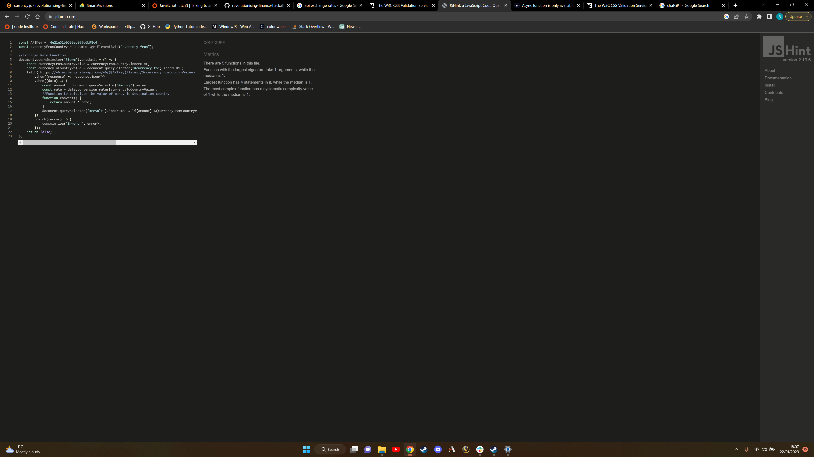
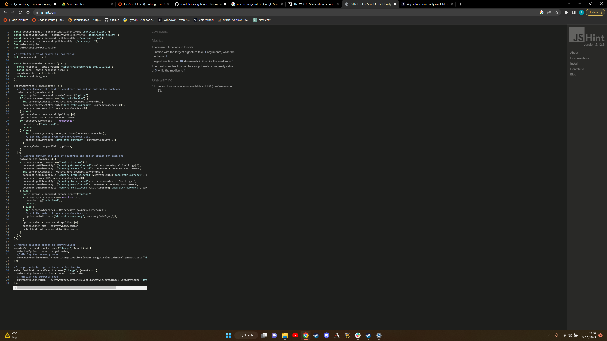
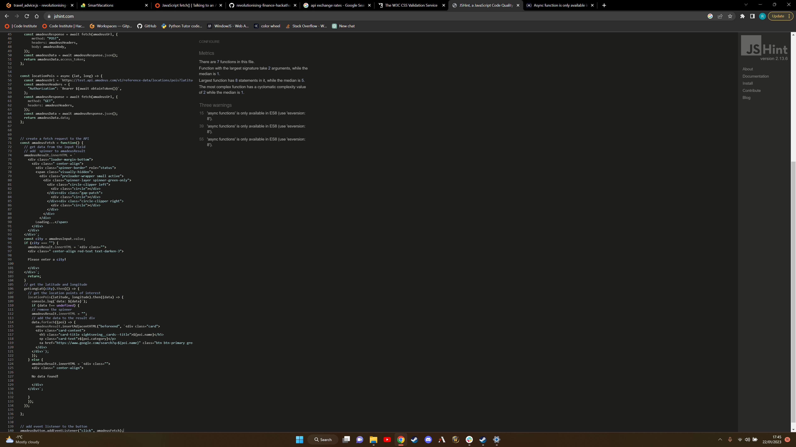

# SmartVacation

## Table of Content
​
* [About](#about)
  * [User Experience Design](#user-experience-design)
  * [Target Audience](#target-audience)
  * [User Stories](#user-stories)
    * [First Time Visitor Goals](#first-time-visitor-goals)
    * [Frequent User Goals](#frequent-user-goals)
* [Technologies Used](#technologies-used)
    * [Languages](#languages)
    * [Frameworks and Libraries](#frameworks-and-libraries)
* [Design](#design)
  * [Wireframes](#wireframes)
  * [Color Scheme](#color-scheme)
  * [Typography](#typography)
  * [Imagery](#imagery)
* [Features](#features)
    * [Future Features](#future-features)
* [Testing](#testing)
* [Development and deployment](#development-and-deployment)
    * [Local Deployment](#local-deployment)
    * [Deployment to GitHub](#deployment-to-github)
* [Credits](#credits)
  * [Acknowledgments](#acknowledgements)
  * [Collaborators](#collaborators)
  * [Image Credits](#image-credits)

# About 

SmartVacation is a web application designed for mature adults who are wanting to travel to a particular destination and know more about the currency type, currency exchange rate against their native currency and find out what there is to do in their travel destination.

This project has been created as part of the Code Institute Hack-a-Thon January 2023, the theme of which was _Revolutioning Finance for 2023_.  

[Click here for deployed website.](https://iuliiakonovalova.github.io/revolutionising-finance-hackathon/)

## User Experience Design

* The initial user design was that users of the web app would be able to use APIs to: 
    * Match a currency with a country of choice
    * Match that particular currency with their own native currency and find out the exchange rate
    * Match a city to find out what there is to do in that destination with prices

## Target Audience

Travelling enthusiasts and individuals that want to be able to find out more about a specific country of choice.

## User Stories:

#### <u>First Time Visitor Goals:</u>

* As a First Time Visitor, I want to be able to view the navigation bar brand logo and information.
* As a First Time Visitor, I want to be able to find useful information in the footer.
* As a First Time Visitor, I want to easily understand the main purpose of the site and learn more about it.
* As a First Time Visitor, I want to be able to easily navigate throughout the web app with a consistent design.
* As a First Time Visitor, I want to be able to find content related to the web app and its services.
* As a First Time Visitor, I want to look for information about the company and the team behind it.
* As a First Time Visitor, I want to be able to easily get in touch with the company with any questions I may have.
* As a First Time Visitor, I want to find the app useful, consistent and easy to use.

#### <u>Frequent User Goals:</u>

* As a Frequent User, I want to be able to easily get the currency of a country I need.
* As a Frequent User, I want to be able to easily get the exchange rate for the currency I need.
* As a Frequent User, I want to get travelling advice for the places I want to visit and estimate the cost of my trip in advance.
* As a Frequent User, I want to be able to use a reliable app on my desktop and mobile.
* As a Frequent User, I want to be able to comfortably use web app without any errors.

## Technologies Used

### Languages

* [HTML5](https://www.w3schools.com/html/)
* [CSS3](https://www.w3schools.com/css/)
* [JavaScript](https://www.javascript.com/)

### Frameworks and libraries

* [MaterializeCSS](https://materializecss.com/)

## Design

### Wireframes

[Wireframes](documentation/wireframes/hackathon_jan_20223.pdf)

### Color Scheme

Green color was chosen as the main color for the project due to the the fact that it is associated with nature and positivity. Green can inspire feelings of harmony, growth, safety, and success. It’s also a calming color that makes people feel safe and comfortable which is highly important when it comes to finance.

### Typography

To be added.

### Imagery

All images that have been picked for this project have been chosen based on their relevancy to the theme at hand: finance and travel.

## Features

The SmartVacations web application consists of a single landing page with diverse yet simple features. They are split into the following components:

* Navigation bar
* Information grid
    * Top grid
    * Bottom grid
* Currency calculator
* City attractions and prices
    * Search results
* Footer

**Navigation bar**

* Located at the top of the page, it includes the website brand name and logo.
* Contains a light green background.

**Information grid**

* Top Grid

    * Contains a large, eye-catching title
    * Located below the navigation bar feature
    * Serves as an introduction for the user
    * Contains an image representing the theme of travelling
    * Contains a 'Get Started' button, which brings user down to the currency calculator when clicked.

    

* Bottom Grid 

    * Compliments the top grid for appealing user design
    * Contains a large, eye-catching title
    * Contains an image representing the theme of finance
    * Contains further information for the user

    

**Currency calculator** 

* Contained within a green coloured card. Green colour is slighter darker than navigation bar and footer to compliment colour design.
* Contains a clear title for the Currency calculator.
* Contains drop-down select feature for picking a resident country.
* Contains automatic input that updates currency data from API based on picked country.
* Contains a drop-down select feature for picking a go-to country.
* Contains automatic input that updates currency data from API based on that same picked country.
* Features an input bar where user enters the amount of money to convert
* Contains 'Convert' button which carries out the calculation with the API currency data.

**City attractions and prices**

* Contains a clear title that matches the colour scheme with a dark green colour.
* Features an input field for users to enter their desired city destination
* Features a 'Search' button which matches the colour scheme with a darker green colour.

* Also contains a loading icon when API is being requested and loaded.

**City attractions and prices search results** 

* Features a list of results relating to the searched city destination
* Contains a title of the particular event or location popularly known in user search results
* Contains a 'Sight' sub-title to inform user of search results
* Contains a 'Go Somewhere' button that redirects users to a list of google results related to user searched item.
* Information is contained within a card that corresponds with the colour scheme.

**Footer**

* Contains a colour design that corresponds to the web app colour scheme design
* Green colour tone corresponds with that of the navigation bar so as to maintain colour scheme consistency.
* Contains the logo of the brand
    * Logo brand can be clicked on and returns user back to the top of the page, so as to maintain user-friendly design
* Contains the brand name with a consistent design to the navigation bar
* Features a 'Thank You' note
* Features an alphabetical list of the collaborators on this project
    * Each collaborator name can be clicked on to open a separate tab to their GitHub profile.
* Contains a 'Copyright' section at the very bottom, with a slightly darker green tone design to compliment colour scheme.
    * The 'Copyright' date has been created with a simple yet smart JavaScript code that allows it update itself automatically every coming year.

## Future features

- Adding a feature for estimating savings through cryptocurrency / index markets.
- Extending the Amadeus API to the paid version which would give access to a Tour trips package library.
- Adding a feature where you select the country you are traveling to and the app will automatically setup a travel budget for you depending on user input of budget limits(Over the top exclusive / exclusive / Mediocre / cheap / under the rug cheap).
- Setting up a savings goal for a trip in mind.
- Creating pre-built travel packages.
- Live currency exchange charts.
- Currency / cryptocurrency historical charts readily available.

## Testing

### JS Validation

- currency.js validation
     

- rest_countries.js validation
    

- travel_advice.js validation
    

- index.html validation
    

## Development and deployment

The development environment used for this project was GitPod and VSCode. 

Each software developer on the team created their own individual branch divergent from `main` from the get-go and have communicated via Slack to collaborate, pitch ideas, fix bugs and talk about relevant Pull Requests. Regular commits and pushes to Github have been employed to be able to track and trace the development process of the web application.

For local deployments instructions shall be written below, along with instructions with deployment to Heroku, the hosting service used to deploy this particular website. Heroku was chosen as the hosting service due to its database maintenance capabilities.

### Local Deployment

This repository can be cloned and run locally with the following steps:

* Login to GitHub.
* Select repository named: IuliiaKonovalova/revolutionising-finance-hackathon.
* Click code toggle button and copy the url (i.e., https://github.com/IuliiaKonovalova/revolutionising-finance-hackathon.git).
* In your IDE, open terminal and run the git clone command (i.e., `git clone https://github.com/IuliiaKonovalova/revolutionising-finance-hackathon.git`). The repository will now be cloned in your workspace.

### Deployment to GitHub

The live version of the project is deployed at GitHub pages.

The procedure for deployment followed the "Creating your site" steps provided in GitHub Docs.

* Log into Github.
* Select desired GitHub Repository to be deployed live.
* Underneath the repository name, click the “Settings” option.
* In the sub-section list on the left, under “Code and automation”, click “Pages”.
* Within the ”Source” section choose ”main” as Branch and root as folder and click ”Save”.
* The page refreshes and a website shall then deploy via a link.
* The following is the live link deployed: https://iuliiakonovalova.github.io/revolutionising-finance-hackathon/

## Credits

* [Adobe](https://www.adobe.com/creativecloud/design/hub/guides/meaning-of-green-in-design#:~:text=Associated%20with%20nature%20and%20positivity,as%20your%20design's%20primary%20color.) - for information regarding the meaning of 'green' in design.
* [Pexels](https://www.pexels.com/) - for brilliant choice of generic, high quality images for the Hack-a-thon theme.
* [ExchangeRateAPI](https://app.exchangerate-api.com/dashboard) - for the data fetched by the network request for Currency Exchange.
* [RESTCountriesAPI](https://restcountries.com/) - for the data fetched by the network request for Countries.
* [AmadeusAPI](https://amadeus.com/en) - for the data fetched by the network request for travel information on cities.
* [AmIResponive](https://ui.dev/amiresponsive) - for the responsive design photo of the web application.

## Acknowledgements

A big thank you to the Code Institute Hack-a-Thon team for voluntarily organising these brilliant events that challenges us software developers to be able to continuously learn, grow and collaborate with other like-minded developers. 

## Collaborators

Our team is made up of a wonderful group of people from around the world - all of which are either past or present students of the [Code Institue](https://codeinstitute.net/global/)

- Albin Hall - [Github](https://github.com/AlbinHall)
- Alexander Tastad - [Github](https://github.com/AVTpepper)
- Iuliia Konovalova - [Github](https://github.com/IuliiaKonovalova)
- Keiron Liam Chaudhry - [Github](https://github.com/keironchaudhry)
- Richard Bailey [Github](https://github.com/Rsrbai)

## Image Credits

* For images displayed in grid contents:

    [Pexels](https://www.pexels.com/):
    - Image 1: https://www.pexels.com/photo/person-holding-world-globe-facing-mountain-346885/
    - Image 2: https://www.pexels.com/photo/person-holding-10-and-10-euro-banknotes-3943746/
